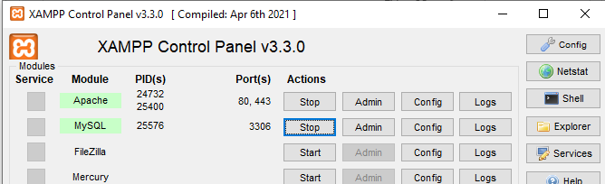

# CTF_Environment
CTF_Environment is a *Capture-The-Flag* platform for students and faculty of ECPI University. 

# Development Quick Start

## Prerequisites

1. XAMPP 8.2.12
2. Node 25.1.0
3. Composer
4. 7zip or enable the zip extension in `php.ini` for your php installation
5. Git

## First time setup
Start Apache and MySQL in the XAMPP control panel:


``` POWERSHELL
# Navigate to the htdocs folder
cd C:\xampp\htdocs

# Clone the repo
git clone https://github.com/ECPI/CTF_Environment.git

# Navigate into the project folder
cd CTF_Environment

# Install dependencies
composer install
npm install

# Copy .env file from secure location into project root

# Create development database (MySQL must be started in XAMPP)
php artisan migrate:fresh --seed
```

## Running the app
Ensure Apache and MySQL are started in the XAMPP control panel.

>[!NOTE]
You don't need to use XAMPP control panel if you are using sqlite in your .env

``` POWERSHELL
# Start vite for development to get static files
npm run dev
```
In another terminal, start the development server:
``` POWERSHELL
php artisan serve
```
The server should now be serving at [http://localhost:8000](http://localhost:8000)

## Run Tests/Lint
``` POWERSHELL
# Run linter
npm run lint

# Run tests
php artisan test
```
